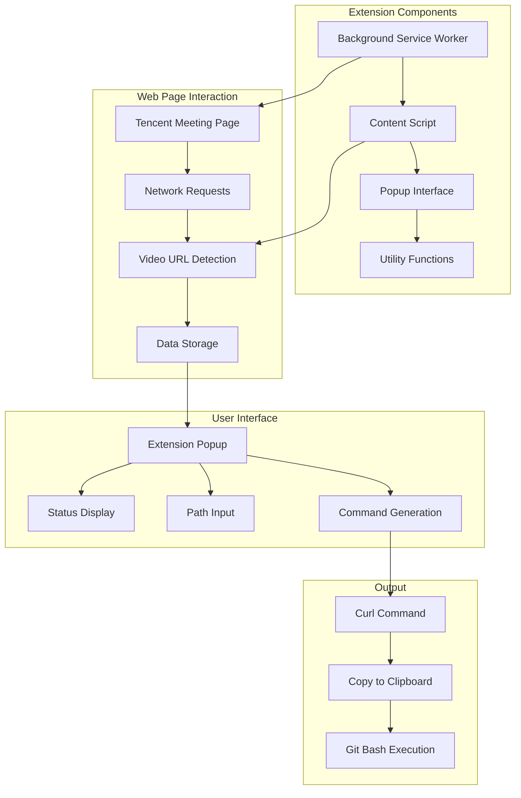
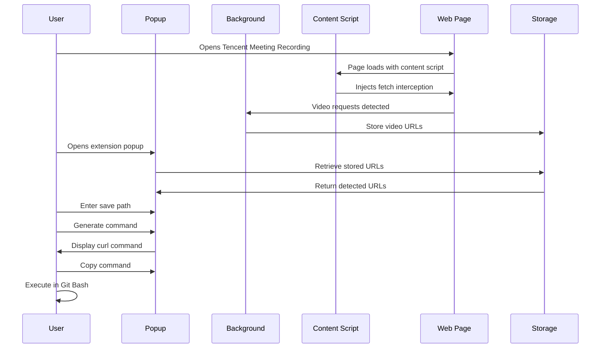

<div align="center"><a name="readme-top"></a>

[](#)

# 🚀 Tencent Meeting Recording Downloader<br/><h3>Chrome Extension for Effortless Video Downloads</h3>

A powerful Chrome browser extension that automatically detects and downloads Tencent Meeting recording videos with just a few clicks.<br/>
Features intelligent URL detection, optimized download commands, and a clean user interface.<br/>
One-click **FREE** deployment of your meeting video downloads.

[Chrome Web Store][chrome-store] · [Changelog][changelog] · [Documentation][docs] · [Issues][github-issues-link]

<br/>

[][chrome-store]

<br/>

<!-- SHIELD GROUP -->

[![][github-release-shield]][github-release-link]
[![][chrome-rating-shield]][chrome-store]
[![][license-shield]][github-license-link]<br/>
[![][github-stars-shield]][github-stars-link]
[![][github-forks-shield]][github-forks-link]
[![][github-issues-shield]][github-issues-link]<br/>
[![][github-contributors-shield]][github-contributors-link]

**Share Project Repository**

[![][share-x-shield]][share-x-link]
[![][share-telegram-shield]][share-telegram-link]
[![][share-whatsapp-shield]][share-whatsapp-link]
[![][share-reddit-shield]][share-reddit-link]

<sup>🌟 Revolutionizing the way you download meeting recordings. Built for professionals and educators worldwide.</sup>

## 📸 Extension Screenshots

> [!TIP]
> Experience the clean and intuitive interface designed for maximum efficiency.

<div align="center">
  
  
  <p><em>Extension Interface - Video Detection and Download Command Generation</em></p>
</div>

<div align="center">
  
  <p><em>Available on Chrome Web Store</em></p>
</div>

<details>
<summary><kbd>📱 More Screenshots</kbd></summary>

<div align="center">
  
  <p><em>Feature Overview and Usage Instructions</em></p>
</div>

</details>

## 🎬 Demo Video

> [!NOTE]
> Watch the extension in action - from detection to download completion.

<div align="center">

https://github.com/user-attachments/assets/31666ea2-6f05-47f2-a7af-383a6fdb6f1d

*Complete walkthrough of the extension functionality*

</div>

**Tech Stack Badges:**

<div align="center">

 
 
 
 
 

</div>

</div>

> [!IMPORTANT]
> This Chrome extension leverages Manifest V3 architecture with modern JavaScript ES6+ features. It combines intelligent network request interception with user-friendly interface design to provide seamless video downloading capabilities from Tencent Meeting recordings.

<details>
<summary><kbd>📑 Table of Contents</kbd></summary>

#### TOC

- [🚀 Tencent Meeting Recording Downloader](#-tencent-meeting-recording-downloader)
      - [TOC](#toc)
  - [🌟 Introduction](#-introduction)
  - [✨ Key Features](#-key-features)
    - [`1` Intelligent Video Detection](#1-intelligent-video-detection)
    - [`2` Optimized Download Commands](#2-optimized-download-commands)
    - [`*` Additional Features](#-additional-features)
  - [🛠️ Tech Stack](#️-tech-stack)
  - [🏗️ Architecture](#️-architecture)
    - [Extension Architecture](#extension-architecture)
    - [Component Structure](#component-structure)
  - [🚀 Getting Started](#-getting-started)
    - [Installation Methods](#installation-methods)
    - [Quick Setup](#quick-setup)
    - [Development Setup](#development-setup)
  - [📖 Usage Guide](#-usage-guide)
    - [Basic Usage](#basic-usage)
    - [Advanced Configuration](#advanced-configuration)
  - [⌨️ Development](#️-development)
    - [Local Development](#local-development)
    - [Building Extension](#building-extension)
    - [Testing](#testing)
  - [🤝 Contributing](#-contributing)
  - [❤️ Sponsor](#️-sponsor)
  - [📄 License](#-license)
  - [👥 Team](#-team)

####

<br/>

</details>

## 🌟 Introduction

We are passionate developers creating next-generation Chrome extensions for enhanced productivity. By adopting modern web extension standards and intelligent automation, we aim to provide users with powerful, reliable, and user-friendly tools for managing digital content.

Whether you're an educator, business professional, or content creator, this extension will be your go-to solution for downloading Tencent Meeting recordings. Please note that this project is actively maintained, and we welcome feedback for any [issues][issues-link] encountered.

> [!NOTE]
> - Chrome Browser version 88+ required
> - Access to Tencent Meeting recording pages required
> - Git Bash recommended for executing download commands
> - Sufficient disk space for video files

| [![][chrome-store-badge]][chrome-store]   | No complex setup required! Install directly from Chrome Web Store and start downloading.                           |
| :------------------------------------ | :--------------------------------------------------------------------------------------------- |
| [![][github-shield-badge]][github-link] | Join our developer community! Connect with contributors and users for support and feature requests. |

> [!TIP]
> **⭐ Star us** to receive all release notifications from GitHub without delay!

[![][image-star]][github-stars-link]

<details>
  <summary><kbd>⭐ Star History</kbd></summary>
  <picture>
    <source media="(prefers-color-scheme: dark)" srcset="https://api.star-history.com/svg?repos=ChanMeng666%2Ftencent-meeting-video-downloader&theme=dark&type=Date">
    
  </picture>
</details>

## ✨ Key Features

### `1` Intelligent Video Detection

Experience next-generation video URL detection technology. Our intelligent network request interception automatically identifies Tencent Meeting recording URLs in real-time, eliminating manual URL extraction and providing seamless detection capabilities.

<div align="center">
  
  <p><em>Automatic video detection in action</em></p>
</div>

Key capabilities include:
- 🎯 **Real-time Detection**: Instantly identifies video URLs during playback
- 🔍 **Smart Filtering**: Filters only relevant meeting recording URLs
- 📱 **Cross-domain Support**: Works across Tencent's content delivery networks
- 🛡️ **Privacy Secure**: No data collection or external transmission

> [!TIP]
> The extension monitors network requests using Chrome's webRequest API to detect video files from myqcloud.com domains specifically related to meeting recordings.

[![][back-to-top]](#readme-top)

### `2` Optimized Download Commands

Revolutionary curl command generation that creates platform-specific download commands with optimized headers and authentication. Our advanced command builder ensures reliable downloads while maintaining compatibility with various terminal environments.

<div align="center">
  
  <p><em>Optimized curl command generation interface</em></p>
</div>

**Command Features:**
- **Cross-platform**: Windows path conversion for Git Bash compatibility
- **Header Optimization**: Includes necessary headers for authentication
- **Error Prevention**: Removes problematic request headers automatically

[![][back-to-top]](#readme-top)

### `*` Additional Features

Beyond the core functionality, this extension includes:

- [x] 🚀 **One-Click Installation**: Install directly from Chrome Web Store
- [x] 🎨 **Clean Interface**: Intuitive popup design with clear status indicators
- [x] 📋 **Command Copying**: One-click copy functionality for generated commands
- [x] 🔒 **Secure Operations**: No external data transmission or storage
- [x] ⚡ **Lightweight**: Minimal resource usage and fast performance
- [x] 🌐 **Multi-URL Support**: Handles multiple video URLs in single session
- [x] 🛠️ **Developer Friendly**: Open source with clear code structure
- [x] 📱 **Responsive Design**: Works across different screen sizes

> ✨ More features are continuously being added based on user feedback and requirements.

<div align="right">

[![][back-to-top]](#readme-top)

</div>

## 🛠️ Tech Stack

<div align="center">
  <table>
    <tr>
      <td align="center" width="96">
        
        <br>JavaScript ES6+
      </td>
      <td align="center" width="96">
        
        <br>Chrome APIs
      </td>
      <td align="center" width="96">
        
        <br>Webpack 5
      </td>
      <td align="center" width="96">
        
        <br>Babel
      </td>
      <td align="center" width="96">
        
        <br>CSS3
      </td>
      <td align="center" width="96">
        
        <br>HTML5
      </td>
    </tr>
  </table>
</div>

**Core Technologies:**
- **Extension Framework**: Chrome Extension Manifest V3
- **Language**: JavaScript ES6+ with modern async/await patterns
- **Build System**: Webpack 5 with optimized bundling
- **Transpilation**: Babel for cross-browser compatibility
- **Styling**: Modern CSS3 with responsive design
- **Architecture**: Modular component-based structure

**Chrome Extension APIs:**
- **webRequest**: Network request interception and monitoring
- **storage**: Local data persistence for detected URLs
- **runtime**: Inter-component communication and messaging
- **action**: Popup interface and icon management

**Development Tools:**
- **Build Process**: Webpack with hot reloading support
- **Code Quality**: ESLint configuration for consistent code style
- **Asset Management**: Automated copying and optimization
- **Module System**: ES6 imports/exports with tree shaking

> [!TIP]
> Each technology was selected for optimal performance, security, and maintainability in the Chrome extension ecosystem.

## 🏗️ Architecture

### Extension Architecture

> [!TIP]
> This architecture follows Chrome Extension Manifest V3 best practices, ensuring security, performance, and future compatibility.



### Component Structure

```
src/
├── background/
│   └── background.js      # Service worker for request monitoring
├── content/
│   └── content.js         # Page injection and URL detection
├── popup/
│   ├── popup.html         # User interface layout
│   ├── popup.js           # Interface logic and interaction
│   └── popup.css          # Styling and responsive design
├── utils/
│   └── download.js        # Command generation utilities
└── assets/
    ├── icon16.png         # Extension icons
    ├── icon48.png
    └── icon128.png
```

### Data Flow Architecture



### Code Architecture Visualization

<details>
<summary><kbd>📁 Project Structure</kbd></summary>

```
tencent-meeting-video-downloader/
├── src/                    # Source files
│   ├── background/        # Background service worker
│   ├── content/          # Content script injection
│   ├── popup/            # User interface components
│   ├── utils/            # Utility functions
│   └── assets/           # Icons and resources
├── dist/                 # Built extension files
├── public/              # Public assets
├── icons/               # Extension icons
├── versions/            # Release archives
├── manifest.json        # Extension manifest
├── package.json         # Dependencies and scripts
├── webpack.config.js    # Build configuration
└── README.md           # Documentation
```

</details>

## 🚀 Getting Started

### Installation Methods

> [!IMPORTANT]
> Choose the installation method that best fits your needs. Chrome Web Store installation is recommended for regular users.

### Method 1: Chrome Web Store (Recommended)

**Direct Installation:**

1. **Visit Chrome Web Store** - Go to the [extension page][chrome-store]
2. **Add to Chrome** - Click "Add to Chrome" button
3. **Confirm Installation** - Click "Add extension" in the popup
4. **Pin Extension** - Pin the extension to your toolbar for easy access

🎉 **Success!** The extension is now installed and ready to use.

### Method 2: Manual Installation

**Development Installation:**

```bash
# 1. Download latest release
wget https://github.com/ChanMeng666/tencent-meeting-video-downloader/releases/latest/download/tencent-meeting-video-downloader.zip

# 2. Extract the archive
unzip tencent-meeting-video-downloader.zip
```

**Chrome Setup:**
1. Open Chrome and go to `chrome://extensions/`
2. Enable "Developer mode" (top-right toggle)
3. Click "Load unpacked"
4. Select the extracted folder
5. Extension appears in toolbar

### Quick Setup

**Getting Started in 3 Steps:**

1. **Install Extension** using either method above
2. **Open Tencent Meeting Recording** and start video playback
3. **Click Extension Icon** to detect and download videos

### Development Setup

**For Developers:**

```bash
# Clone repository
git clone https://github.com/ChanMeng666/tencent-meeting-video-downloader.git
cd tencent-meeting-video-downloader

# Install dependencies
npm install

# Build extension
npm run build

# Development with hot reload
npm run watch
```

**Load Development Extension:**
1. Build creates `dist/` folder
2. Load `dist/` folder as unpacked extension in Chrome
3. Changes auto-reload during development

> [!TIP]
> Use `npm run watch` for automatic rebuilding during development.

## 📖 Usage Guide

### Basic Usage

**Step-by-Step Process:**

1. **Open Recording Page**
   - Navigate to your Tencent Meeting recording
   - Start video playback (this triggers URL detection)

2. **Activate Extension**
   - Click the extension icon in Chrome toolbar
   - Extension automatically detects available videos

3. **Configure Download**
   - Enter your desired save path (e.g., `D:/meeting_video.mp4`)
   - Include the filename with `.mp4` extension

4. **Generate Command**
   - Click "Generate Download Command"
   - Copy the generated curl command

5. **Execute Download**
   - Open Git Bash or terminal
   - Paste and execute the command
   - Wait for download completion

#### User Interface Walkthrough

<div align="center">
  
  <p><em>Step 1-3: Extension interface showing video detection and path input</em></p>
</div>

<div align="center">
  
  <p><em>Step 4-5: Command generation and execution instructions</em></p>
</div>

**Example Usage:**

```bash
# Example generated command
curl 'https://yunluzhi-az-1258344699.file.myqcloud.com/recording_example.mp4' \
  -H 'authority: yunluzhi-az-1258344699.file.myqcloud.com' \
  -H 'user-agent: Mozilla/5.0 (Windows NT 10.0; Win64; x64) AppleWebKit/537.36' \
  -H 'referer: https://meeting.tencent.com/' \
  --compressed \
  --output '/d/meeting_video.mp4'
```

### Advanced Configuration

**Path Configuration Tips:**

```bash
# Windows paths (converted automatically)
D:\Videos\meeting.mp4
C:\Users\Username\Documents\video.mp4

# Unix-style paths (for Git Bash)
/d/Videos/meeting.mp4
/c/Users/Username/Documents/video.mp4
```

**Troubleshooting Common Issues:**

| Issue | Solution |
|-------|----------|
| No video detected | Ensure video is playing and page is fully loaded |
| Path errors | Use forward slashes and include file extension |
| Command fails | Check internet connection and file permissions |
| Extension not working | Refresh page and try again |

> [!TIP]
> Always include the `.mp4` extension in your save path for proper file handling.

## ⌨️ Development

### Local Development

**Setup Development Environment:**

```bash
# Clone repository
git clone https://github.com/ChanMeng666/tencent-meeting-video-downloader.git
cd tencent-meeting-video-downloader

# Install dependencies
npm install

# Start development mode
npm run watch
```

**Development Scripts:**

```bash
# Build for production
npm run build

# Development with hot reload
npm run watch

# Clean build directory
rm -rf dist/
```

### Building Extension

**Production Build:**

The build process uses Webpack to:
- Transpile modern JavaScript with Babel
- Bundle modules and dependencies
- Copy static assets and manifest
- Optimize for production deployment

```bash
# Create production build
npm run build

# Output structure
dist/
├── background.js      # Background service worker
├── content.js         # Content script
├── popup.js          # Popup interface logic
├── popup.html        # Popup HTML
├── manifest.json     # Extension manifest
└── icons/           # Extension icons
```

### Testing

**Manual Testing Process:**

1. **Load Extension** - Load unpacked extension in Chrome
2. **Test Detection** - Visit Tencent Meeting recording pages
3. **Verify Commands** - Generate and test download commands
4. **Cross-browser** - Test in different Chrome versions

**Testing Checklist:**
- [ ] Extension loads without errors
- [ ] Video URLs are detected correctly
- [ ] Commands generate with proper formatting
- [ ] Download commands execute successfully
- [ ] Interface responds correctly to user actions

## 🤝 Contributing

We welcome contributions! Here's how you can help improve this extension:

**Ways to Contribute:**
- 🐛 **Bug Reports**: Report issues with detailed reproduction steps
- 💡 **Feature Requests**: Suggest new functionality or improvements
- 🔧 **Code Contributions**: Submit pull requests with enhancements
- 📚 **Documentation**: Help improve documentation and examples
- 🌐 **Translations**: Add support for additional languages

**Development Process:**

1. **Fork Repository** - Create your own fork
2. **Create Branch** - `git checkout -b feature/amazing-feature`
3. **Make Changes** - Implement your improvements
4. **Test Thoroughly** - Ensure all functionality works
5. **Submit PR** - Create pull request with clear description

**Code Style Guidelines:**
- Use modern JavaScript ES6+ features
- Follow existing code formatting
- Add comments for complex logic
- Test changes thoroughly before submitting

[![][pr-welcome-shield]][pr-welcome-link]

<a href="https://github.com/ChanMeng666/tencent-meeting-video-downloader/graphs/contributors" target="_blank">
  <table>
    <tr>
      <th colspan="2">
        <br><br><br>
      </th>
    </tr>
  </table>
</a>

## ❤️ Sponsor

Support our extension development and help us continue building amazing tools for the community!

**Why Sponsor?**
- 🚀 **Faster Development**: More resources for feature development
- 🐛 **Better Support**: Priority bug fixes and support
- 🌟 **New Features**: Funding for advanced functionality
- 📱 **Platform Expansion**: Support for other browsers

**Sponsor Benefits:**
- 🎯 **Priority Support**: Get help faster with issues
- 🏷️ **Recognition**: Listed as sponsor in documentation
- 💬 **Direct Access**: Direct communication channel
- 📊 **Influence**: Voice in feature prioritization

## 📄 License

This project is licensed under the Apache-2.0 License - see the [LICENSE](LICENSE) file for details.

**License Benefits:**
- ✅ Commercial use allowed
- ✅ Modification allowed  
- ✅ Distribution allowed
- ✅ Private use allowed
- ✅ Patent grant included

## 👥 Team

<div align="center">
  <table>
    <tr>
      <td align="center">
        <a href="https://github.com/ChanMeng666">
          
          <br />
          <sub><b>Chan Meng</b></sub>
        </a>
        <br />
        <small>Creator & Lead Developer</small>
      </td>
    </tr>
  </table>
</div>

## 🙋‍♀️ Author

**Chan Meng**
-  LinkedIn: [chanmeng666](https://www.linkedin.com/in/chanmeng666/)
-  GitHub: [ChanMeng666](https://github.com/ChanMeng666)
-  Email: [chanmeng.dev@gmail.com](mailto:chanmeng.dev@gmail.com)
-  Website: [chanmeng.live](https://2d-portfolio-eta.vercel.app/)


For issues and feature requests, please submit an [Issue](https://github.com/ChanMeng666/tencent-meeting-video-downloader/issues).

## 🚨 Troubleshooting

<details>
<summary><kbd>🔧 Common Issues & Solutions</kbd></summary>

### Extension Issues

**Extension Not Detecting Videos:**
```bash
# Checklist:
1. Ensure video is actively playing
2. Refresh the meeting recording page
3. Check if extension is enabled
4. Verify you're on a supported domain
```

**Command Generation Fails:**
```bash
# Possible solutions:
1. Check save path format (include filename.mp4)
2. Ensure proper permissions for target directory
3. Verify network connectivity
```

### Download Issues

**Curl Command Errors:**
- Ensure Git Bash is installed and properly configured
- Check that the save directory exists
- Verify internet connection stability
- Try running command with `--verbose` flag for debugging

**File Permission Errors:**
```bash
# Create directory if it doesn't exist
mkdir -p /d/Videos/

# Check write permissions
ls -la /d/Videos/
```

</details>

## 📚 FAQ

<details>
<summary><kbd>❓ Frequently Asked Questions</kbd></summary>

**Q: Does this extension work with all Tencent Meeting recordings?**
A: The extension works with recordings hosted on Tencent's myqcloud.com CDN. Most standard meeting recordings are supported.

**Q: Is the extension safe to use?**
A: Yes, the extension only monitors network requests and doesn't collect or transmit any personal data. All operations are performed locally.

**Q: Can I download multiple videos at once?**
A: Currently, the extension generates commands for the most recent video detected. Multiple downloads require separate command generation.

**Q: What browsers are supported?**
A: The extension is designed for Google Chrome and Chromium-based browsers supporting Manifest V3.

**Q: How do I report bugs or request features?**
A: Please create an issue on our [GitHub repository](https://github.com/ChanMeng666/tencent-meeting-video-downloader/issues) with detailed information.

</details>

---

<div align="center">
<strong>🚀 Simplifying Meeting Recording Downloads 🌟</strong>
<br/>
<em>Empowering professionals, educators, and content creators worldwide</em>
<br/><br/>

⭐ **Star us on GitHub** • 🏪 **Install from Chrome Store** • 🐛 **Report Issues** • 💡 **Request Features** • 🤝 **Contribute**

<br/><br/>

**Made with ❤️ by the Tencent Meeting Recording Downloader team**


</div>

---

<!-- LINK DEFINITIONS -->

[back-to-top]: https://img.shields.io/badge/-BACK_TO_TOP-151515?style=flat-square

<!-- Project Links -->
[chrome-store]: https://chromewebstore.google.com/detail/gdajdfngeonjmcclghkmeoacopnnfpnc
[changelog]: https://github.com/ChanMeng666/tencent-meeting-video-downloader/releases
[docs]: https://github.com/ChanMeng666/tencent-meeting-video-downloader#readme

<!-- GitHub Links -->
[github-issues-link]: https://github.com/ChanMeng666/tencent-meeting-video-downloader/issues
[github-stars-link]: https://github.com/ChanMeng666/tencent-meeting-video-downloader/stargazers
[github-forks-link]: https://github.com/ChanMeng666/tencent-meeting-video-downloader/forks
[github-contributors-link]: https://github.com/ChanMeng666/tencent-meeting-video-downloader/contributors
[github-release-link]: https://github.com/ChanMeng666/tencent-meeting-video-downloader/releases
[issues-link]: https://github.com/ChanMeng666/tencent-meeting-video-downloader/issues
[pr-welcome-link]: https://github.com/ChanMeng666/tencent-meeting-video-downloader/pulls
[github-license-link]: https://github.com/ChanMeng666/tencent-meeting-video-downloader/blob/main/LICENSE
[github-link]: https://github.com/ChanMeng666/tencent-meeting-video-downloader

<!-- Shield Badges -->
[github-release-shield]: https://img.shields.io/github/v/release/ChanMeng666/tencent-meeting-video-downloader?color=369eff&labelColor=black&logo=github&style=flat-square
[chrome-rating-shield]: https://img.shields.io/chrome-web-store/rating/gdajdfngeonjmcclghkmeoacopnnfpnc?color=4285F4&labelColor=black&logo=google-chrome&logoColor=white&style=flat-square
[license-shield]: https://img.shields.io/badge/license-Apache--2.0-white?labelColor=black&style=flat-square
[github-contributors-shield]: https://img.shields.io/github/contributors/ChanMeng666/tencent-meeting-video-downloader?color=c4f042&labelColor=black&style=flat-square
[github-forks-shield]: https://img.shields.io/github/forks/ChanMeng666/tencent-meeting-video-downloader?color=8ae8ff&labelColor=black&style=flat-square
[github-stars-shield]: https://img.shields.io/github/stars/ChanMeng666/tencent-meeting-video-downloader?color=ffcb47&labelColor=black&style=flat-square
[github-issues-shield]: https://img.shields.io/github/issues/ChanMeng666/tencent-meeting-video-downloader?color=ff80eb&labelColor=black&style=flat-square
[pr-welcome-shield]: https://img.shields.io/badge/🤝_PRs_welcome-%E2%86%92-ffcb47?labelColor=black&style=for-the-badge

<!-- Badge Variants -->
[chrome-store-badge]: https://img.shields.io/badge/CHROME%20STORE-INSTALL-4285F4?labelColor=black&logo=google-chrome&style=for-the-badge
[github-shield-badge]: https://img.shields.io/badge/GITHUB-CONTRIBUTE-181717?labelColor=black&logo=github&style=for-the-badge

<!-- Social Share Links -->
[share-x-link]: https://x.com/intent/tweet?hashtags=ChromeExtension,TencentMeeting&text=Check%20out%20this%20amazing%20Chrome%20extension%20for%20downloading%20Tencent%20Meeting%20recordings&url=https%3A%2F%2Fgithub.com%2FChanMeng666%2Ftencent-meeting-video-downloader
[share-telegram-link]: https://t.me/share/url?text=Check%20out%20this%20Chrome%20extension%20for%20Tencent%20Meeting%20downloads&url=https%3A%2F%2Fgithub.com%2FChanMeng666%2Ftencent-meeting-video-downloader
[share-whatsapp-link]: https://api.whatsapp.com/send?text=Check%20out%20this%20Chrome%20extension%20https%3A%2F%2Fgithub.com%2FChanMeng666%2Ftencent-meeting-video-downloader
[share-reddit-link]: https://www.reddit.com/submit?title=Chrome%20Extension%20for%20Tencent%20Meeting%20Downloads&url=https%3A%2F%2Fgithub.com%2FChanMeng666%2Ftencent-meeting-video-downloader

[share-x-shield]: https://img.shields.io/badge/-share%20on%20x-black?labelColor=black&logo=x&logoColor=white&style=flat-square
[share-telegram-shield]: https://img.shields.io/badge/-share%20on%20telegram-black?labelColor=black&logo=telegram&logoColor=white&style=flat-square
[share-whatsapp-shield]: https://img.shields.io/badge/-share%20on%20whatsapp-black?labelColor=black&logo=whatsapp&logoColor=white&style=flat-square
[share-reddit-shield]: https://img.shields.io/badge/-share%20on%20reddit-black?labelColor=black&logo=reddit&logoColor=white&style=flat-square

<!-- Images -->
[image-star]: https://via.placeholder.com/800x200/FFD700/000000?text=Star+Us+on+GitHub
</rewritten_file>
